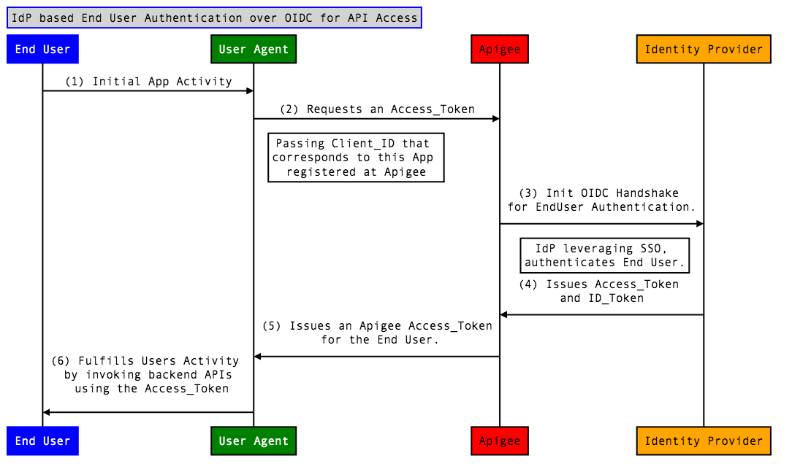

# End-user Authentication for API access via OpenId Connect ([OIDC](https://openid.net/developers/specs/)).

A deployable solution implementing the [end-user Authentication for API Access Reference Architecture](https://apigeedemo.net/config)

## Solution Architecture: 

### Architecture Modules:
**Identity Provider Module** :

Any Identity Provider that supports OIDC. This solution has been tested with the following Identity Providers:

- [Google IAM](https://developers.google.com/identity/protocols/OpenIDConnect).
- [ForgeRock](https://backstage.forgerock.com/docs/am/6.5/oidc1-guide/#chap-oidc1-introduction).
- [Okta](https://developer.okta.com/docs/api/resources/oidc/#endpoints)
- [PingFederate](https://documentation.pingidentity.com/pingfederate/pf84/#adminGuide/concept/openIdConnect.html) 

**User Agent Module** : 

User Agent can be a Browser App (Single Page App, Smart Client based App) or a Native Mobile App.

**API Platform Module**:  
Apigee is the API platform

## Simplified Solution Flow Diagram

|  |
|--------------------------|
||
| |

**Sequence flow**:

**Step 1** : End user initiates Application activity. This could be the very first time end-user accesses the App.

**Step 2**: User Agent checks if the Access_Token is already present. In this case this check fails (initial activity) and User Agent starts an Access_Token request against Apigee. The User Agent does so by passing Apigee issued Client_ID for the App.

**Step 3**: Apigee identifies the Client_ID and looks up the configured Identity Provider. Based on the Identity Providers metadata, Apigee initiates a OpenId Connect handshake.

**Step 4**: The Identity Provider authenticates the End User in SSO fashion. After successful Authentication issues OIDC Id_Token to Apigee.

**Step 5**: Apigee leverages the User Info provided by identity Provider and creates Apigee OAuth Access_Token.

**Step 6**: This Access_Token will be used going forward to request APIs on behalf of the end-user.

## Detailed Architecture Diagram

| Detailed Solution Flow |
|--------------------------|
||
| |

## Pre-Requisites:  
#### Identity Provider Configuration
You need your Identity Provider have Apigee registered as OpenId Connect relying party.
Refer the setup instructions for following Identity Providers: [ForgeRock](https://backstage.forgerock.com/docs/am/6.5/oidc1-guide/#chap-oidc1-introduction), [Okta](https://developer.okta.com/docs/api/resources/oidc/#endpoints), [Ping](https://documentation.pingidentity.com/pingfederate/pf84/#adminGuide/concept/openIdConnect.html) and [Google](https://developers.google.com/identity/protocols/OpenIDConnect).

#### You will need the following information from Identity Provider:

| Property |  Description |
|  :---: | :-- |
| **idp.atz_code.hostname.value** | Hostname of your Identity Provider's OIDC Authorization Code Endpoint.   **Note**: Just provide the hostname, no need to provide ~~https://~~.   (For ex: dev-12345.okta.com) |
| **idp.atz_code.endpoint.value** | OAuth2 authorization code grant type endpoint of your Identity Provider.   **Note**: Do not include leading or trailing slash.   (For Ex: oauth2/v1/authorize)  |
| **idp.atz_code_to_token.endpoint.value** | OAuth2 token code grant type endpoint of your Identity Provider.   **Note**: Do not include leading or trailing slash.   (For Ex: oauth2/v1/token)  |
| **idp.jwks.hostname.value** | Hostname of your Identity Provider's JWKS Endpoint.   **Note**: Just provide the hostname, no need to provide ~~https://~~.   (For ex: dev-12345.okta.com)  |
| **idp.jwks.endpoint.value** | OIDC jwks endpoint of your Identity Provider.  **Note**: Do not include leading or trailing slash.  (For Ex: oauth2/v1/keys)  |
| **idp.userinfo.hostname.value** | Hostname of your Identity Provider's OIDC UserInfo Endpoint.  **Note**: Just provide the hostname, no need to provide ~~https://~~   (For ex: dev-12345.okta.com)   |
| **idp.userinfo.endpoint.value** | OIDC UserInfo endpoint of your Identity Provider.   **Note**: Do not include leading or trailing slash.   (For Ex: oauth2/v1/userinfo)  |
| **idp.scope.value** | OIDC scope values configured at your Identity Provider  |
| **idp.audience.value** | Audience value of your Open Id Connect Configuration.   This value will be used while validating the Identity Provider issues JWT Token  |
| **idp.issuer.value** | Issuer value of your Open Id Connect Configuration.  This value will be used while validating the Identity Provider issues JWT Token  |
| **idp.subject.value** | Subject value of your Open Id Connect Configuration.  This value will be used while validating the Identity Provider issues JWT Token  |
| **idp.client.id.value** | This is the Client Id representing Apigee at your Identity provider.  |
| **idp.client.secret.value** | This is the Client_Secret issued by Identity Provider for Apigee.  |
| **idp.atz_code.cache.ttl.value** | This is the _Time to Live_ value of issued Authorization Code in Apigee's Cache.   Default value is 300 seconds.  |
| **idp.jwks.cache.ttl.value** | This is the _Time to Live_ value of retrieved JWKS keys from OIDC provider.   Default value is 300 seconds.  |
| **credential_mapper.ttl.value** | This is the _Time to Live_ value of mapped credentials in Apigee's Cache.   Default value is 360000 seconds.  |
| **relay_state.ttl.value** | This is the _Time to Live_ value of OIDC relay-state attribute in Apigee's Cache.   Default value is 300 seconds.  |
|  |   |

#### Apigee Account Registration:
You will need to register for a trial version of Apigee or have access to an Apigee Enterprise Organization.  You will need following details about your Apigee Account :-
- Apigee Organization Name
- Apigee Environment Name
- Apigee Organization Admin Account Username
- Apigee Organization Admin Account Password

Ensure you have access to your Apigee Organization where you want to deploy this solution.

#### Maven In Path: 
Make sure you have installed and configured Maven in the path.

#### NPM and Node: 
You will need to install NPM version 6.X or higher and Node Version 10.X or higher

## Installation Instruction: 

The above solution is provided as a package as part of this project and can be configured following the below steps:
- Clone the repo `git https://github.com/nas-hub/enduser-authentication-for-api-access-via-oidc`
- Navigate to IdP_Pattern_1B_OIDC directory - `cd IdP_Pattern_1A_OIDC`
- Update the IDP configurations in the [config.properties](./config.properties)
- Execute `npm install`
- Execute `node setup.js` and follow the prompts

 
**node setup.js prompts**

| prompt |  Description |
|  :--- | :-- |
| **Please provide the Apigee Edge Organization name:** | Enter your Apigee Org Name.  |
| **Please provide the Apigee Edge Environment name:** |  Enter your Apigee Org's environment where these policies will be deployed. |
| **Please provide the Proxy name** | Enter a descriptive name for this new proxy.  |
| **Please provide the Proxy basepath** | Enter the base path for this new proxy.  |
| **Please provide the Apigee KeyValueMap name where the IDP configurations will be stored** | Enter the name of new KVM (Key Value Map) that will be created to store Identity Provider details provided in the config.properties  |
| **Please provide the Apigee Edge username** |  Enter your Apigee Username |
| **Please provide the Apigee Edge password** |  Enter your Apigee password |
| | |

**Success** Upon successful deployment of this proxy, the *node setup.js* should provide you with a json config file under the **target** folder. 

At this point the solution should be deployed on your Apigee Org, and should be ready for use. Follow below steps to see the solution working end to end.

### Testing the Solution

1. Go to [Config Apigee Demo App](https://apigeedemo.net/config)
2. Click the **Import** button on top right corner to import the above generated json config file.
3. Click Update after importing the json config file.
4. You should be on login page that has Login button.
5. Clicking the Login Button will initiate a OIDC based login with your Identity Provider via Apigee. You can also turn on the **trace** for this proxy on Apigee to see the proxy functionality.
6. At this point you should have Access Token issued by Apigee and should be able to introspect the token, as well as invoke APIs with this token.

### Report Issues
 
 [Please report issues here](https://github.com/nas-hub/enduser-authentication-for-api-access-via-oidc/issues/new)

